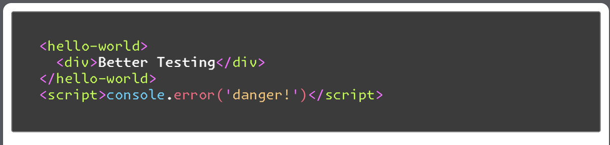

# textarea-code-block

Web Component for making a Textarea element into a syntax highlighted codeblock!



Based on
[Font with Built-In Syntax Highlighting](https://blog.glyphdrawing.club/font-with-built-in-syntax-highlighting/),
this component allows you to _progressively enhance_ any `<textarea>` elements
with code into easy-to-read code blocks.

## Features

- Syntax Highlights HTML, JS, and CSS based on font rules (does not clutter DOM)
- Progressively enhances textarea elements, allowing non-JS experiences to still
  work
- Pre-baked with sane styling, and easy to add to your own

## How to use

Import the component using your CDN of choice or installing from npm, and then
wrap any textarea with code in the new `<code-block>` element!

```html
<script defer src="https://unpkg.com/textarea-code-block@1"></script>

<code-block>
  <textarea>
    <hello-world>
      <div>Better Testing</div>
    </hello-world>
    <script>console.error('danger!')</script>
  </textarea>
</code-block>
```

If you are dynamically creating or changing the textarea element, you can run
`.processTextarea()` to update the `<code-block>` element based on the new
content.

```html
<script src="https://unpkg.com/textarea-code-block@1"></script>

<code-block id="cb">
  <textarea id="t"></textarea>
</code-block>

<script>
  t.innerHTML = `
    <!-- this is dynamically added content -->
    <style>
      h1 { color: blue; }
    </style>
    <h1>Hello World</h1>
  `;
  cb.processTextarea();
</script>
```

## Definition Loading & Defer

Using `defer` in the script tag is required if you have DOM content in your
template you want to process automatically. If you are using `.processTextarea`,
you'll need to either also defer those scripts, or import the definition without
`defer`.

If you have ideas on how to make that more elegant,
[feel free to reach out](https://fosstodon.org/@jrjurman)!

## Credit

The font included is from Heikki Lotvonen's
[Font with Built-In Syntax Highlighting](https://blog.glyphdrawing.club/font-with-built-in-syntax-highlighting/).
