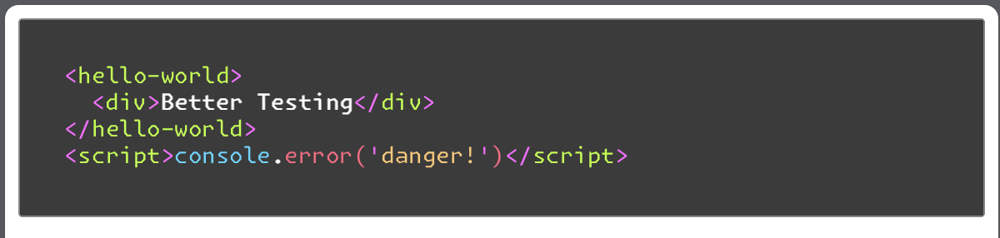

# textarea-code-block

Web Component for making a Textarea element into a syntax highlighted codeblock!



See live example here: https://codepen.io/JRJurman/pen/GRVRxqe

Based on
[Font with Built-In Syntax Highlighting](https://blog.glyphdrawing.club/font-with-built-in-syntax-highlighting/),
this component allows you to _progressively enhance_ any `<textarea>` elements
with code into easy-to-read code blocks.

## Features

- Syntax Highlights HTML, JS, and CSS based on font rules (does not clutter DOM)
- Progressively enhances textarea elements, allowing non-JS experiences to still
  work
- Pre-baked with sane styling, and easy to add to your own

## How to use

Import the component using your CDN of choice or installing from npm, and then
wrap any textarea with code in the new `<code-block>` element!

```html
<script src="https://unpkg.com/textarea-code-block@1"></script>

<code-block>
  <textarea>
    <hello-world>
      <div>Better Testing</div>
    </hello-world>
    <script>console.error('danger!')</script>
  </textarea>
</code-block>
```

If you are dynamically creating or changing the textarea element, you can run
`.processTextarea()` to update the `<code-block>` element based on the new
content. There is a mutation observer included to also auto-update on new
elements being inserted.

## Credit

The font included is from Heikki Lotvonen's
[Font with Built-In Syntax Highlighting](https://blog.glyphdrawing.club/font-with-built-in-syntax-highlighting/).
